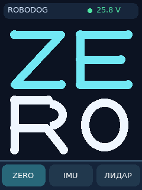
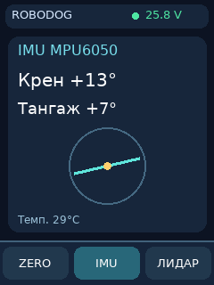
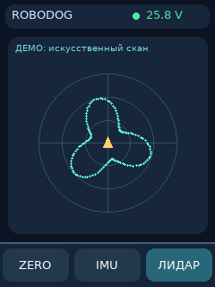

# RoboDog Zero

Прошивки и инструкции для квадропеда на **Arduino Pro Mini 3,3 В / 8 МГц**, **Arduino Mega 2560** и **Orange Pi AIpro 8T**. Восемь шаговых двигателей 1,8° / 1,5 А на фазу работают через TMC2209 v2.0 и редукторы **12:1**. Питание — **8S LiFePO4**. Две платы по четыре драйвера обслуживают разные стороны робота. Нуль каждого сустава находится по собственному концевику; действительное соответствие разъёмов выясняется при пусконаладке.

Пульт → HC-05 (Bluetooth Classic SPP) → Orange Pi → `Serial3` Mega → две UART-шины TMC2209 и STEP/DIR. В обратную сторону идут напряжение батареи, состояние Mega и IMU. Coin D6 подключается к Orange Pi отдельным переходником **USB–UART**. TFT 2,4″ установлен **вертикально, 240×320**: основной экран показывает крупное **ZE** над **RO**, внизу выбираются ZERO, IMU и LiDAR.

  

## С чего начать

1. Откройте [пусконаладку от первого питания до движения](docs/commissioning.md). Она задаёт порядок проверки питания, пульта, восьми датчиков, восьми моторов, Orange Pi и первого HOME.
2. Для перепутанных или разных NO/NC концевиков используйте [отдельную инструкцию с таблицей проверки каждого входа](docs/limit-switches.md). Итоговая Mega-прошивка позволяет сопоставить любой J1–J8 с любым уникальным D42–D49 и отдельно задать активный уровень.
3. Заполните локальный профиль через [`tools/generate_calibration.py`](tools/generate_calibration.py) по [описанию полей](commissioning/README.md). Генератор проверяет карту, углы и пределы, создаёт `calibration.h` сначала с заблокированным ARM; физически проверенная конфигурация разблокируется отдельным `--unlock`.

| Устройство | Тест | Основная программа и инструкция |
|---|---|---|
| Пульт Pro Mini | [`RoboDogRemoteTest`](firmware/RoboDogRemoteTest/) — экран, кнопки и приём | [`RoboDogRemoteFinal`](firmware/RoboDogRemoteFinal/) · [загрузка и связь](firmware/README.md) |
| Mega 2560 | [`RoboDogMotorMap`](firmware/RoboDogMotorMap/) — одиночные ограниченные jog, сырые уровни датчиков | [`RoboDogMegaFinal`](firmware/RoboDogMegaFinal/) · [управление, ток, калибровка](firmware/RoboDogMegaFinal/README.md) |
| Orange Pi AIpro 8T | `python -m robodog.app --demo --snapshot --page 0/1/2` | [`orange_pi`](orange_pi/) · [openEuler, Bluetooth, TFT, Coin D6](orange_pi/README.md) |

Папки содержат самостоятельные программы для своих плат. Не объединяйте стендовую и основную прошивки Mega в один скетч. Локальные адреса последовательных портов, SPI, GPIO, Bluetooth и индивидуальные углы хранятся в конфигурации конкретной сборки. [Бланк измерений](docs/orange-pi/Mega-calibration-worksheet.csv) можно распечатать перед заполнением профиля.

## Что делает программа

- Пульт показывает напряжение и **приблизительный** процент 8S LiFePO4, меняя цвет индикатора по диапазонам; передаёт кнопки и принимает телеметрию.
- Mega настраивает два UART-сегмента TMC2209, контролирует питание, аварийный сигнал, свежесть команд и программные пределы, последовательно ищет восемь концевиков, задаёт позы и предоставляет отдельно включаемую диагональную траекторию.
- Orange Pi мостит HC-05 и Mega, показывает три страницы на сенсорном TFT, читает IMU из телеметрии и скан Coin D6 с USB-переходника. Демо-скан явно подписан; отсутствие реальных пакетов не маскируется картинкой.
- Сборки AVR, проверки протокола/движения, генератора калибровки и PNG-рендеринга запускаются на компьютере. [Порядок проверки на живом роботе](docs/commissioning.md) остаётся обязательной частью установки: исходный код не способен измерить полярность проводов или геометрию ног удалённо.

Проект рассчитан на ручное управление и поэтапное включение движения. Диагональная траектория не заменяет обратную кинематику стоп, контроль контакта с землёй или активную стабилизацию; её включают только после проверки собранной механики на опоре. Заявлять проверенную автономную ходьбу по результатам компьютерных тестов было бы неверно. Материалы сторонних архивов, переписка и установщики не копируются в репозиторий.
